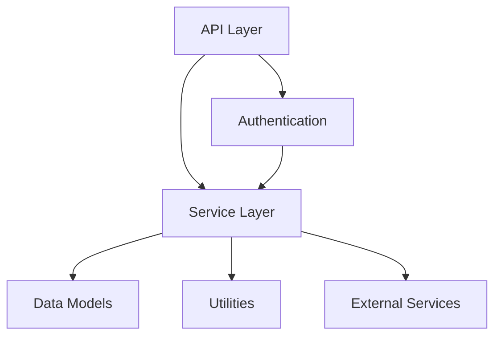

# Saturday — Hierarchical Code Graph Engine (HCGE)
# =================================================
# Template for project understanding. Saturday auto-populates this
# when scanning a project with `/project_scan`.

## Level 0: Repository Map

```
project_root/
├── src/                    # Application source code
│   ├── api/                # API routes and controllers
│   ├── models/             # Data models and schemas
│   ├── services/           # Business logic layer
│   ├── utils/              # Shared utilities
│   └── config/             # Configuration files
├── tests/                  # Test suites
│   ├── unit/
│   ├── integration/
│   └── e2e/
├── docs/                   # Documentation
├── scripts/                # Build and deployment scripts
├── docker/                 # Container definitions
└── infra/                  # Infrastructure as code
```

_Auto-populated by `CodeGraphEngine.scan_directory()`_

## Level 1: Module Dependency Graph



_Auto-populated by `CodeGraphEngine.build_dependency_graph()`_

## Level 2: File-Level Outlines

For each file, Saturday maintains:
- **Classes**: Names, base classes, method signatures
- **Functions**: Names, parameters, return types
- **Imports**: Dependencies and their sources
- **Constants**: Module-level constants and configs
- **Complexity**: Cyclomatic complexity scores

_Auto-populated by `CodeGraphEngine.get_file_outline()`_

## Level 3: Business Logic → Code Mapping

| Business Requirement | Code Location | Owner |
|---|---|---|
| User Authentication | `src/auth/service.py` | Auth Team |
| Payment Processing | `src/payments/processor.py` | Payments Team |
| Data Export | `src/exports/handler.py` | Data Team |

_Populated as Saturday discovers business logic during code review sessions._

## Level 4: Evolution Context

### Recent Changes (Auto-tracked)
| Date | File | Change | Impact |
|---|---|---|---|
| _Pending_ | _Auto-populated from git history_ | | |

### Architecture Drift Alerts
- _None detected_

### Technical Debt Register
| Item | Severity | Location | Estimated Fix |
|---|---|---|---|
| _Pending_ | _Auto-populated during scans_ | | |

## Graph Statistics

- **Files Tracked**: _pending scan_
- **Total Lines**: _pending scan_
- **Languages Detected**: _pending scan_
- **Dependency Depth**: _pending scan_
- **Last Scanned**: _never_
